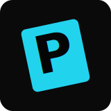

<p align="center">
  
</p>

<h1 align="center">PanelPass</h1>

<p align="center">
  <strong>A local-first comic reader for your browser.</strong>
  <br />
  Read <code>.cbz</code>, <code>.zip</code>, and <code>.cbr</code> comics with no backend, no server-side accounts, and no database service.
</p>

<p align="center">
  
  
  
  
</p>

---

## ✨ What It Does

PanelPass is a React/Vite single-page app that parses comic archives directly in the browser. By default, your library lives in IndexedDB on your device. If you want cross-device access, you can connect Google Drive and store extracted pages in your own Drive folder.

| Area | Highlights |
| --- | --- |
| 📚 Library | Cover grid, drag-and-drop uploads, progress bars, completion marks, delete controls, reading stats |
| 🧭 Sorting | Sort by comic name or recently viewed |
| 📖 Reader | Single page, dual-page spread, one-page webtoon, all-pages vertical scroll, all-pages horizontal scroll |
| 🔎 Navigation | Keyboard shortcuts, swipe gestures, page scrubber, direct page jump |
| 🧩 Zoom | Double-click or double-tap panel zoom |
| 🎨 Themes | Light and dark reader themes |
| ☁️ Drive | Optional Drive import, optional extracted cloud storage, optional progress sync |

## 🗂️ Supported Formats

- `.cbz`
- `.zip`
- `.cbr`

CBZ/ZIP parsing uses `jszip`. CBR/RAR parsing uses `node-unrar-js`.

## 💾 Storage Modes

### 🖥️ Local Storage

The default mode saves comic metadata and archive blobs in browser IndexedDB through `localforage`.

Local mode works offline after import and does not upload your files anywhere. Clearing browser site data can remove the saved library.

### ☁️ Google Drive Import

The Drive picker scans a folder named exactly `panelpass` in the signed-in user's Google Drive and lists `.cbz` and `.cbr` files. Imported Drive files can be copied into the local browser library.

### 🌐 Google Drive Cloud Storage

When Google Drive Cloud Storage is enabled in Settings, PanelPass extracts each imported comic page and uploads the page library to:

```text
panelpass/extracted/comics/<comic-title>/
```

Each extracted comic folder contains page images and a `metadata.json` file. Reading progress can also sync through:

```text
panelpass/config/lastViewed.csv
```

## 🛠️ Tech Stack

- React 19
- TypeScript
- Vite 6
- Tailwind CSS v4 through `@tailwindcss/vite`
- IndexedDB persistence through `localforage`
- CBZ/ZIP parsing through `jszip`
- CBR/RAR parsing through `node-unrar-js`
- Google OAuth through `@react-oauth/google`
- Icons from `lucide-react`

## 🚀 Getting Started

### Prerequisites

- Node.js 20 or newer
- npm

### Install

```bash
npm install
```

### Run Locally

```bash
npm run dev
```

The Vite dev server runs on `http://localhost:3000` and listens on `0.0.0.0`.

## 🔐 Google Drive Setup

Google Drive is optional. Local uploads work without any environment variables.

To enable Drive import and Drive cloud storage:

1. Create an OAuth client ID in Google Cloud.
2. Configure the local app URL as an authorized JavaScript origin.
3. Add the client ID to `.env.local`:

```bash
VITE_GOOGLE_CLIENT_ID=your-google-oauth-client-id
```

4. Create a folder named `panelpass` in Google Drive.
5. Add `.cbz` or `.cbr` files to that folder.

PanelPass requests Drive readonly and Drive file scopes so it can list/download comics from the `panelpass` folder and create/update its own extracted comic and progress files.

## 📜 Scripts

```bash
npm run dev      # start Vite on port 3000
npm run build    # create production build in dist/
npm run preview  # preview the production build
npm run lint     # run TypeScript with no emit
npm run clean    # remove dist/ and server.js
```

## 🧱 Project Structure

```text
src/
  App.tsx                         # Top-level library, reader, and settings routing
  types.ts                        # Shared Comic, ComicSource, and reader types
  components/
    GoogleDrivePicker.tsx         # OAuth flow and Drive comic import modal
    HowToUse.tsx                  # First-run guide modal
    Library.tsx                   # Uploads, bookshelf, sorting, stats, deletion
    Reader.tsx                    # Comic reader modes, progress, gestures, themes
    Settings.tsx                  # Local vs. Drive storage settings
  lib/
    db.ts                         # IndexedDB/localforage metadata and file stores
    googleDrive.ts                # Drive API helpers and extracted-library sync
    parser.ts                     # CBZ/ZIP and CBR/RAR parser
    utils.ts                      # Class merging, ID generation, formatting
```

## 🔒 Privacy

PanelPass is local-first. In local storage mode, comic archives remain in the current browser's IndexedDB.

Google Drive features only run after you connect a Google account. In Drive cloud storage mode, imported comics are extracted and uploaded to your own Google Drive under the `panelpass` folder.

## 📄 License

See [LICENSE](LICENSE).
